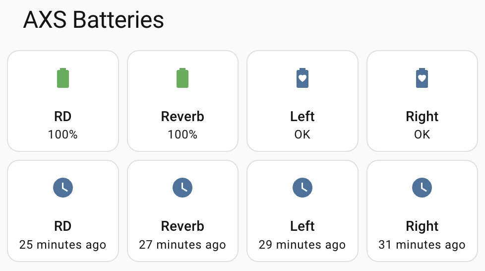

# esphome-sram-axs

Battery levels from SRAM AXS (eTap) components in Home Assistant, decoded **on-device** by an ESP32 running ESPHome. No app, no pairing, no HA-Bluetooth stack required: AXS components broadcast their battery state in BLE advertisements whenever they're awake, and this component reads it out of the air.

**v0.1.0.** The protocol decode is done and documented (`docs/`), and the component is validated on hardware: it runs live against the author's bike, feeding a Home Assistant dashboard and a low-battery phone notification. The card below is that dashboard.



## Requirements

- An ESP32 dev board **with Bluetooth LE**: the classic ~$5 `esp32dev`-class boards work; ESP32-S2 and ESP8266 boards have no BLE radio and won't.
- A USB cable for the first flash (updates after that go over-the-air).
- [ESPHome](https://esphome.io/guides/getting_started_command_line): `pip install esphome`, or the Home Assistant add-on.

## Configuration

One `sram_axs:` entry per physical component, matched by serial; every sensor is opt-in. Last-known values are restored from flash after a reboot (last-seen included when its time source is configured), so the entities aren't blank until the bike's next wake:

```yaml
external_components:
  - source: github://tarekrached/esphome-sram-axs
    components: [sram_axs]

esp32_ble_tracker:

sram_axs:
  - serial: 1234567890        # the decimal number from your component's discovery
    name: "Left Shifter"      # line: see "Finding your device serial numbers"
    battery_status:           # coin-cell components (shift controllers): "OK",
      name: "Left Shifter Battery Status"    # "Low - replace soon", "Critical - replace now"
    battery_voltage:
      name: "Left Shifter Battery Voltage"

  - serial: 1234567891
    name: "Rear Derailleur"
    battery_voltage:
      name: "Rear Derailleur Battery Voltage"
    battery_percent:          # AXS-pack components only: coin-cell components report no percentage
      name: "Rear Derailleur Battery Percent"
```

`battery_status` is the headline for coin-cell components: they broadcast no percentage (and the official SRAM app shows no percentages for anything, three coarse bands only), so the component derives a status string from their live voltage, with thresholds set from observed CR2032 behavior: warn at 2.80 V, past the discharge knee, and critical at 2.75 V, a small margin above the ~2.7 V where a dying cell was still running.

The full version with all entity types (RSSI, last-seen, battery status for coin devices), per-field caveats, and the verbose `dump_unknown` flag (hex-dumps raw payloads at DEBUG; for protocol debugging, not needed for finding serials) is [`example.yaml`](example.yaml).

## Finding your device serial numbers

Every awake AXS component advertises under the name `SRAM <serial>`; that decimal number is what `serial:` wants, and the component reads it off the air for you:

1. Download [`example.yaml`](example.yaml) and create a `secrets.yaml` next to it:

   ```yaml
   wifi_ssid: "YourNetwork"
   wifi_password: "your-password"
   ```

2. Flash it, unchanged: `esphome run example.yaml`. The first flash goes over USB. Don't edit the placeholder serials yet; serial discovery is always on, and the first flash *is* the discovery step.

3. With the log window open (`esphome run` stays attached after flashing; `esphome logs example.yaml` reopens it later), wake the bike: press a shifter's AXS button (it broadcasts for ~20 seconds) or shake the bike (the rear derailleur broadcasts for ~5 minutes). Every AXS component whose serial isn't in the config announces itself:

   ```
   [20:31:10][I][sram_axs:171]: Discovered SRAM AXS serial=1304203903 (coin-cell, 3.05 V, device_id=10, rssi -76 dBm) - add to your sram_axs config to publish sensors
   ```

4. Put your serials and names into the `sram_axs:` block in place of the placeholders, and run `esphome run example.yaml` again. This flash goes over-the-air: seconds, no cable.

5. Done: the entities appear in Home Assistant through the standard ESPHome integration, and an automation can nag you when a battery runs low.

Using the Home Assistant add-on instead of the CLI: create a new device in the ESPHome dashboard, paste in `example.yaml`, and the same steps apply from the web UI (INSTALL for the flashes, LOGS for the discovery lines).

The discovery line's pack/coin-cell label separates the device classes for you: *pack* (~8 V) is a rechargeable AXS battery (rear derailleur, dropper post), *coin-cell* (~3 V) is a CR2032 shift controller. To split the left controller from the right, wake one at a time: press one AXS button and that serial appears for the next ~20 seconds (shift-paddle clicks wake nothing, and shaking the bike wakes only the derailleur). RSSI helps too if you hold the board next to one component.

Two more ways to read serials, no ESP32 required: any phone BLE scanner (nRF Connect, LightBlue) shows the same `SRAM <serial>` names when you wake the bike, and the SRAM AXS app itself shows each component's serial on its Component Detail page, already labeled left/right, and it's the same number the component advertises. That field isn't copyable, but a screenshot plus your phone's text recognition gets it out.

## Why this exists

SRAM's app shows you battery state when you open it next to the bike. Head units show it mid-ride. Neither tells you *before* you kit up that the derailleur is at 8%, which is the one moment the information is actually useful. And the resolution is poor anyway: the official app shows no percentages at all, just three coarse bands, while the broadcasts carry live millivolts. A $5 ESP32 near where the bike is parked closes both gaps: every time the bike is touched, battery levels flow into Home Assistant, and an automation can nag you before it matters.

## Protocol in one paragraph

Awake AXS components advertise under SRAM's Bluetooth SIG member UUID `0xFE51` with manufacturer data under company ID `0x0933`. The payloads carry live battery voltage (mV, you can watch it wobble with ADC noise), the **firmware version** (confirmed by diffing advertisements across a real firmware update), the component serial, and, for AXS-pack components only, a battery percent. Components advertise for ~5 minutes after being woken by movement or an AXS-button press, fall silent asleep, and stop broadcasting whenever the official app connects, so the product shape is *burst-on-wake*, not continuous polling. Full teardown: [`docs/protocol.md`](docs/protocol.md).

## Repo layout

- [`docs/protocol.md`](docs/protocol.md): the advertisement format teardown
- [`facts.yaml`](facts.yaml): protocol constants with per-field confidence; the component treats this as its source of truth
- `tools/`: capture utilities (macOS `bleak` scanner, Pi `btmon` session script)
- `components/sram_axs/`: the ESPHome external component
- [`example.yaml`](example.yaml): full worked configuration

## How it relates to prior art

Two Home Assistant custom integrations already exist and deserve credit:

- [ShannoG/home-assistant-sram-axs](https://github.com/ShannoG/home-assistant-sram-axs): passive advertisement listener as a HACS integration (HA-side decode; needs HA's Bluetooth stack or an ESP32 as a dumb proxy).
- [karl-petter/sram-axs-for-ha](https://github.com/karl-petter/sram-axs-for-ha): connects on wake and reads the standard GATT Battery Service (HA-side, connection-based).

This project fills the remaining gap: an **ESPHome-native external component** in the [syssi tradition](https://github.com/syssi/esphome-jk-bms); decode happens on the ESP32 itself, entities arrive over ESPHome's native API (or MQTT), no HA Bluetooth involvement, and the device works standalone. It also aims to carry the deepest public documentation of the AXS advertisement format: this repo's teardown covers fields (live battery voltage in mV, embedded serials, per-device-type advertising windows) not documented elsewhere.

## License

MIT.
